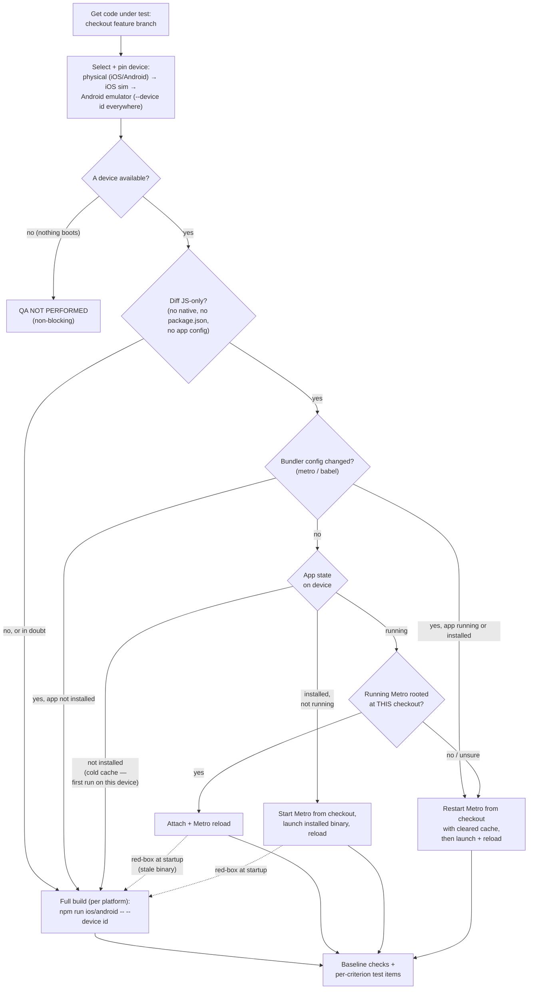

# Agentic Workflow

HolidAI ships an AI-assisted, GitHub-native pipeline that takes a feature issue and produces a
reviewable pull request — implemented, statically reviewed against our rules, and QA'd on a
device. It is built entirely from Claude Code primitives (subagents, skills, a workflow, and the
project's own rules) and lives under `.claude/`.

You **author** issues with the `write-issue` skill, then **run** them through one front door:
`/implement-issue` — a thin orchestrator that judges the issue, grills you only when something
genuinely needs clarifying, and delegates to the single pipeline workflow
(`implement-issue-pipeline`). For headless/batch runs, invoke the workflow directly. See
[Entry points](#entry-points).

---

## Prerequisites

- **agent-device** installed and configured (once per developer) — see
  [agent-device.dev](https://agent-device.dev/) or the `agent-device-configuration` skill. The
  project commits the `Bash(agent-device *)` permission and the `agent-device` skill router, so
  only the per-machine binary + env vars are needed. This is the **mobile** QA engine.
- **agent-browser** installed (`npm i -g agent-browser && agent-browser install`) — the **web**
  QA engine, used by `qa-web-engineer` to drive Chromium. Only needed for issues with a web
  surface.
- **`gh`** authenticated for the HolidAI repository.
- The iOS app buildable/runnable on a simulator (the mobile QA stage drives it via agent-device).
- **CodeGraph** — `npm install` (pins the `@colbymchenry/codegraph` devDependency), then
  `npx codegraph init` once to build the local index (`.codegraph/`, gitignored, auto-synced).
  The committed `.mcp.json` gives `explorer`/`feature-builder` the code-intelligence MCP.

---

## The pieces

| Piece | Location | Role |
|---|---|---|
| Feature issue template | `.github/ISSUE_TEMPLATE/feature.yml` | The **input contract** — `### Description` (what to build) + `### Acceptance criteria` (what QA verifies). Required fields. |
| `write-issue` | `.claude/skills/write-issue/SKILL.md` | Authors a complete, template-conformant issue via `grilling` — front-loads clarification — then puts it on Project #1 with `Status = Ready` so it lands in a board column. |
| `explorer` | `.claude/agents/explorer.md` | Read-only. Maps an issue onto the architecture (target feature/tier, files, pattern, risks). Runs as the pipeline's first phase (default on). |
| `feature-builder` | `.claude/agents/feature-builder.md` | Implements, verifies (tsc + arch, once per build round), commits in small layer-aligned commits, opens the PR. |
| `code-reviewer` | `.claude/agents/code-reviewer.md` | Read-only. Reviews the diff against the rules the linters *don't* enforce. |
| `qa-engineer` | `.claude/agents/qa-engineer.md` | **Mobile** QA. Drives the app on the agent-device (baseline + acceptance criteria) via the device-readiness fast path; returns per-criterion results and its report to the pipeline. Never drives a browser. |
| `qa-web-engineer` | `.claude/agents/qa-web-engineer.md` | **Web** QA. Drives Chromium via `agent-browser` (web baseline + acceptance criteria) against a web target — web Storybook or `expo start --web`. Same structured contract as `qa-engineer`; never drives a simulator. |
| `finding-vetter` | `.claude/agents/finding-vetter.md` | Read-only skeptic. Tries to refute one blocking finding (against the diff, code, and QA evidence) before it can trigger an auto-fix; returns confirmed/refuted/suspect. |
| `qa-baseline` | `.claude/skills/qa-baseline/SKILL.md` | Standing regression checks run for *every* feature (startup, render, navigation). |
| Agent memory | `.claude/agent-memory/` | Committed, per-agent operational lessons (device quirks, tooling facts, timings). Agents read theirs at run start and may append under strict rules; humans curate at PR review — keep or delete. |
| `implement-issue` | `.claude/skills/implement-issue/SKILL.md` | The **front door** (thin orchestrator): judges the issue, grills only if needed (folding answers back into the issue body), announces its reading, then delegates to the pipeline. Contains no pipeline logic. |
| `triage-pr` | `.claude/skills/triage-pr/SKILL.md` | Bot-review triage loop (main-thread skill — it contains human gates): vets every AI-reviewer comment with `finding-vetter`, auto-fixes confirmed findings, resolves noise with short replies, consults the user in chat for judgment calls. Natural termination (bots quiet + grace poll); no round cap, only a stuck tripwire. Human comments untouchable. |
| `implement-issue-pipeline` | `.claude/workflows/implement-issue-pipeline.js` | **THE pipeline** (single encoding): explore → build → wire PR → review ∥ QA (mobile and/or web, routed by `qaTargets`) → finding vetting → bounded auto-fix → one consolidated run comment → visual summary. Owns the canonical defaults. Directly invocable for headless/batch. |
| CodeGraph | `.mcp.json` + `@colbymchenry/codegraph` | Code-intelligence MCP (symbols, call paths, blast radius) that `explorer`/`feature-builder` query instead of grepping. Local index in `.codegraph/` (gitignored). |

Each agent reads the deep architecture docs — [`ARCHITECTURE.md`](ARCHITECTURE.md) and
[`ERROR_HANDLING.md`](ERROR_HANDLING.md) — rather than duplicating the rules.

---

## Entry points

```mermaid
flowchart TD
    WI["write-issue skill<br/>(grilling interview)"] --> ISSUE["Complete Feature-template issue"]
    ISSUE --> FD
    ISSUE -.->|"headless / batch:<br/>invoke workflow directly"| ARGS

    subgraph SKILL["/implement-issue — human-present front door"]
        FD["Stage 0 — Setup:<br/>gh issue view, template check"] --> JUDGE{"Stage 1 — Judge:<br/>real doubts?"}
        JUDGE -->|"no"| ANN["Stage 2 — Announce reading,<br/>proceed without waiting"]
        JUDGE -->|"yes"| GRILL["Grill the user<br/>(grilling skill)"]
        GRILL --> FOLD["Fold answers into the issue body<br/>(with approval; fallback: comment)"]
        FOLD --> ANN
        ANN --> DELEG["Stage 3 — Delegate:<br/>issue, startedAt, flag overrides"]
    end

    DELEG --> ARGS

    subgraph PIPE["implement-issue-pipeline — THE pipeline, single encoding"]
        ARGS["Parse + validate args<br/>(canonical defaults live here)"] --> EXPL{"explore?<br/>(default on)"}
        EXPL -->|"yes"| EXPLORE["explorer maps the issue onto<br/>the architecture (non-blocking)<br/>+ picks qaTargets: mobile / web / both / none"]
        EXPL -->|"skipped / report supplied"| BUILD
        EXPLORE --> BUILD["feature-builder:<br/>branch off origin/main, implement,<br/>tsc + arch once, layer-aligned commits,<br/>open PR with empty body"]
        BUILD -->|"no PR"| FATAL["FATAL — nowhere to report"]
        BUILD --> WIRE["wire, best-effort:<br/>assign PR + project +<br/>QA CLI pre-check (only the<br/>engines qaTargets needs)"]
        WIRE --> VERIFY["review ∥ device QA ∥ web QA<br/>(parallel, independent —<br/>QA lanes run only if in qaTargets)"]
        VERIFY --> VET["vet: one skeptic per<br/>blocking finding"]
        VET --> SORT{"verdict per finding"}
        SORT -->|"refuted"| DROP["excluded from fix,<br/>reported for spot-check"]
        SORT -->|"suspect"| HUMAN["never auto-fixed,<br/>blocks a clean pass,<br/>needs human eyes"]
        DROP --> REPORT
        HUMAN --> REPORT
        SORT -->|"confirmed"| LOOP{"confirmed left and<br/>rounds below maxFix?"}
        LOOP -->|"no"| REPORT
        LOOP -->|"yes"| CONV{"findings-set already<br/>seen in a prior round?"}
        CONV -->|"yes"| STUCK["stuck — stop early,<br/>never reroll"]
        STUCK --> REPORT
        CONV -->|"no"| FIX["feature-builder fix round<br/>(history-aware, PERSISTS markers)"]
        FIX --> VERIFY
        REPORT["ONE consolidated PR comment:<br/>status header + collapsible<br/>build / review / QA / vetting / metrics"]
        REPORT --> VISUAL["visual summary, best-effort:<br/>only if shots were captured —<br/>push qa-evidence/pr-N,<br/>post/update the 📸 marker comment"]
    end

    VERIFY -.->|"any post-build stage throws"| ABORT["abort captured"]
    ABORT --> REPORT
    VISUAL -.->|"aborted: rethrow<br/>after reporting"| FAILED["run fails"]
    VISUAL -->|"completed without abort"| RET["structured return to the caller"]
    RET --> SUMM["skill relays the result"]
    SUMM --> BOTS["AI review bots comment on the PR"]
    BOTS -->|"optional"| TRIAGE["/triage-pr loop:<br/>vet each finding, fix confirmed,<br/>resolve noise, escalate judgment<br/>calls to the human"]
    BOTS -.->|"triage skipped:<br/>human handles bot<br/>threads directly"| PRREV
    TRIAGE -->|"fix commits<br/>trigger re-review"| BOTS
    TRIAGE -->|"bots quiet +<br/>grace poll"| PRREV["Human PR review<br/>(behind the CI gate:<br/>lint + typecheck + arch)"]
    PRREV --> MERGE["Merge — never automated"]
```



- **`write-issue`** interviews you (via `grilling`) and creates a complete, template-conformant
  issue, so downstream runs need no further clarification. It also adds the issue to Project #1
  and sets its `Status` to `Ready` — an item with no status sits in no column, which reads as
  "the issue was never created".
- **`/implement-issue`** judges the issue: crisp → announces its reading and proceeds gate-free;
  real doubts → grills, folds the answers back into the issue body, then proceeds. Either way
  the build itself runs in the pipeline workflow.
- **`implement-issue-pipeline`** is the only encoding of the build stages. Invoke it directly
  (no conversation) for batch/overnight runs on crisp, pre-approved issues.

There is no `--auto` flag: the clarify judgment itself is the router, and PR review is the
approval gate.

---

## The `/implement-issue` flow

```
/implement-issue <issue-number> [--skip-explore] [--skip-review] [--skip-qa] [--worktree] [--max-fix N]
```

| Stage | Interactive? | What happens |
|---|---|---|
| 0 Setup | — | Reads the issue; confirms it follows the Feature template. |
| 1 Judge | ✅ only if doubts | Crisp issue → proceed, no questions. Real doubts → `grilling`, then the clarified issue **body is rewritten** (with your approval) as the single source of truth. |
| 2 Announce | — | States its reading (criteria, target area, flags) and proceeds **without waiting** — interrupt if the reading is wrong. If grilling happened, its closing synthesis is the announcement. |
| 3 Delegate | — | Invokes the `implement-issue-pipeline` workflow with the issue + any flag overrides. |
| 4 Report | — | Relays PR URL, review/QA verdicts, fix attempts, anything outstanding. Never merges. |

### Flags (overrides only — defaults live in the workflow)
- `--skip-explore` — skip the exploration phase (fine for trivial changes).
- `--skip-review` / `--skip-qa` — skip a verify stage when not needed.
- `--worktree` — run code-touching agents in isolated git worktrees so humans can keep editing
  the main checkout. Note: a fresh worktree has no `node_modules`/native build → expect a cold
  install/build (which is why it's opt-in).
- `--max-fix N` — raise the auto-fix round cap.

### The PR contract
- **Title:** meaningful. **Body:** empty (other GitHub reviewer automation overwrites it, and
  regenerates it on every push — anything the pipeline wrote there would be silently wiped).
- **ONE pipeline comment**, posted at run end — even when a stage aborts the run: a short
  status header (verdicts, fix rounds, wall-clock) plus collapsible sections carrying the
  full build, review, mobile-QA, web-QA, vetting, and run-metrics reports. Agents never post
  their own comments.
- **Optionally one visual-summary comment** right after it, and only when the change is
  visually relevant (see below) — captions plus screenshots, nothing else.

---

## The `implement-issue-pipeline` workflow

The single deterministic encoding of the build pipeline: explore → build → wire PR →
review ∥ mobile QA ∥ web QA (parallel — independent stages, each QA lane running only when
the issue has that surface) → finding vetting → bounded auto-fix →
one consolidated run comment (best-effort, attempted even when a post-build stage aborts
the run) → visual summary, with schema-validated verdicts and a hard fix-loop cap. It is **gate-free** —
any clarification happens in `/implement-issue` before it launches; approval happens at PR
review before merge.

Three verification properties worth knowing:

- **Per-criterion QA (traceability).** QA returns one entry per test item (`id`, the
  acceptance criterion it verifies, class, verdict, note); the overall QA verdict is
  **derived in code** (any item FAIL or failed baseline ⇒ FAIL) — a "PASS" provably means
  every criterion was exercised and passed, never a self-reported summary. Evidence spans
  screenshots, logs, and react-devtools state; for pixel-critical transient/animated
  states, short screen recordings with extracted frames (no agent can watch a video —
  every agent can Read the frames).
- **Adversarial vetting.** Every blocking finding gets a read-only skeptic
  (`finding-vetter`) that tries to refute it against the diff, code, and captured QA
  evidence before it can trigger a fix round. Refuted findings are excluded (and reported);
  device claims that can't be verified without re-driving the app become `suspects` — never
  auto-fixed, always surfaced for human eyes, and they block a clean `passed`. Under
  uncertainty the vetter confirms (dropping a real bug is worse than a wasted fix round).
- **Convergent fix loop.** Up to `maxFix` (default 2) fix rounds, but each round must make
  progress: the loop fingerprints every findings-set it fixes against (QA findings key on
  their stable `T`-ids) and stops early with `stuck: true` if a round reproduces any
  previous set — including A→B→A cycles. Later fix prompts are history-aware: findings that
  survived an attempt are marked `[PERSISTS]` and the builder is told what was already
  tried, so round 2 is an escalation with new information, not a reroll of round 1.

Beyond the pipeline's own verification, **CI gates every PR** (human- or pipeline-authored)
with Biome lint, `tsc --noEmit`, and the dependency-cruiser architecture check — a second
net under the builder's once-per-round self-check.

#### Visual summary (last stage)

A change you can see should be reviewable from the PR alone. When the `explorer` proposes
`visualSubjects` (a new screen or component — in the app or in Storybook alone — a restyle, a
colour/spacing change, or a visual bug fix), each QA lane runs a **dedicated capture pass after**
its acceptance-criteria items — deliberate, clean shots, never a reuse of the `T01`/`W01`
assertion screenshots — and returns them as a `manifest`. A lane may drop a subject it could not
reach (saying why) and add one it discovered while testing. **An empty proposal switches the
whole thing off**: no capture, no branch, no comment.

- **Mobile is after-only** (a "before" shot would cost a second native build) and uses the one
  platform QA already ran on; **web captures before/after** for a bug fix — title prefixed
  `[Fix]:`/`[Bug]:` — by serving the same URL from a throwaway **detached worktree of
  `origin/main`** and removing it afterwards. No lane ever switches the branch of the shared
  working tree: review, mobile QA and web QA run in parallel against it (and outside worktree
  isolation the app under test is served from it), so a checkout of `main` would change what
  the other lanes are testing mid-run.
- The pipeline merges both manifests into one ordered plan: mobile units first, before/after
  pairs kept indivisible, capped at **6 images** shared across the lanes (each lane guaranteed
  3 when both have shots, unused slots rolling over — so one lane can take all 6).
- Images are downscaled to 1080 px on the long edge and converted to WebP (raw PNG on failure),
  then pushed to a per-PR branch `qa-evidence/pr-<number>` branched fresh off the PR head and
  force-pushed, so the feature branch's own diff never contains a screenshot. GitHub's
  attachment upload endpoint is browser-session-only, so hosting the bytes is the only way to
  get pixels into a comment from automation; the markdown links them from `raw.githubusercontent.com`.
- The comment carries the hidden marker `<!-- holidai:visual-summary -->` **as its first line** —
  a re-run finds it by that prefix (`startswith`, never `contains`: the run report quotes the
  build and review reports verbatim, marker included, so a substring match would edit the run
  report instead), edits it in place and force-pushes the same file names, so the URLs stay
  stable — and holds nothing but the heading, a bold
  `**<iOS|Android|Storybook|Web> — <what changed>**` caption per shot, and the images
  (before/after pairs as a two-column table).
- A closed PR triggers `.github/workflows/qa-evidence-cleanup.yml`, which deletes the evidence
  branch; the comment is left as-is and its images become broken links, which is accepted.
- Every failure here — capture, conversion, push, posting — is logged and swallowed: the stage
  runs after the run report and can never change the PASS / NOT-PASSED verdict.

#### Device-readiness fast path (QA stage)

The qa-engineer first **selects and pins one device** — a connected physical device (iOS or
Android) wins; else an iOS simulator is preferred (reuse a booted one, else boot one), since
Android emulators are flakier; else an Android emulator is used; else, if nothing can be
obtained, it stops with `QA NOT PERFORMED`. It pins the choice with `--device <id>` for the
whole run and remembers its platform. It then decides between a Metro reload and a full
native build: a JS-only diff on a warm device skips the ~10-minute native build entirely. A
full build forwards the pinned device and uses the platform's build command
(`npm run ios -- --device <id>` or `npm run android -- --device <id>`) so SELECT and the
build/QA run stay on one device.



Invoke it directly (headless/batch) or let `/implement-issue` delegate to it. Args — the
workflow owns these canonical defaults; callers pass only overrides:

| arg | default | meaning |
|---|---|---|
| `issue` | — (required) | the GitHub issue number |
| `explore` | `true` | run the exploration phase (`explorer` maps the issue onto the architecture; its report feeds the builder) |
| `explorerReport` | — | pre-supplied exploration report (skips the phase) |
| `clarifications` | — | clarifications text — fallback channel when the skill did not fold answers into the issue body |
| `review` | `true` | run the code-review stage |
| `qa` | `true` | master switch for the QA stage (pass `false` to skip QA entirely, e.g. unattended environments) |
| `qaTargets` | — (explorer decides) | which runtime surfaces to QA: `['mobile']`, `['web']`, both, or `[]` for none. Omit to let the `explorer` choose from the acceptance criteria and touched files; pass an array to pin it. `[]` skips QA — the right answer for pure tooling/CI/docs/type-only issues, where a QA run could only report BLOCKED. If exploration is skipped or fails, this falls back to **both** so a broken explorer can never silently switch QA off. |
| `worktree` | `false` | isolate code-touching agents in git worktrees (cold install/build cost) |
| `maxFix` | `2` | max auto-fix rounds (hard counter; convergence detection stops earlier when a round makes no progress) |
| `startedAt` | — | Unix epoch (seconds) of run start (`date +%s`), supplied by the caller — fills the wall-clock column in the metrics report |

Returns `{ prUrl, explored, reviewVerdict, qaVerdict, qaItems, qaWebVerdict, qaWebItems,
fixAttempts, stuck, passed, outstanding, suspects, refuted }` — each QA lane reports for
itself: `qaVerdict`/`qaItems` cover mobile QA, `qaWebVerdict`/`qaWebItems` cover web QA, and
a lane that was not selected (or QA switched off entirely) reads `'skipped'` rather than
`null`, so "no surface to verify" never looks like "QA ran and could not be performed".
`outstanding` = confirmed findings left after the fix loop; `stuck` = the loop stopped early
because a round made no progress; `suspects` = unverifiable runtime claims needing human
eyes; `refuted` = findings the vetter dismissed (spot-check them).

---

## The `/triage-pr` loop

After the pipeline opens a PR, the AI review bots (coderabbit, sourcery, cubic)
comment on their own schedule. `/triage-pr <pr>` is a **main-thread skill** (it contains
human gates, so it cannot be a workflow) that drives those threads to zero:

- Every bot finding is vetted by `finding-vetter`: **confirmed** → auto-fixed, committed,
  thread closed with the SHA (push is verified before any thread is resolved) ·
  **refuted** → short evidence-cited reply, resolved · **suspect / judgment** → the user
  decides in chat, mid-loop.
- **Below-bar rule:** the orchestrator may resolve a technically-true finding alone only
  when it is OBJECTIVELY inapplicable (impossible in this repo, or a wrong premise);
  taste- and threshold-shaped calls always go to the user. After wave 1, only clear
  correctness, security, reliability, or data-integrity issues earn a fix.
- **Termination is natural** (no round cap): no unresolved bot threads AND no pending bot
  check runs AND one grace poll still quiet. The only tripwire is the stuck detector — a
  wave whose findings-set repeats a previous wave's hands the loop to the human.
- Human-authored comments are untouchable, and the loop produces no reports — thread
  replies plus a short closing chat message only.

---

## How to use it

1. `write-issue` (or open a Feature-template issue by hand) → a complete issue with Description +
   Acceptance criteria.
2. Implement it:
   - **At the keyboard:** `/implement-issue <n>`. Answer questions only if it finds real doubts;
     otherwise it announces its reading and runs end-to-end.
   - **Headless/batch:** run the `implement-issue-pipeline` workflow with `{ issue: <n> }`
     (add `qa: false` if the environment can't drive a device reliably).
3. Once the AI review bots have commented on the fresh PR, optionally run
   `/triage-pr <pr>` — it drives the bot threads to zero and consults you in chat only
   where judgment lives.
4. Review the resulting PR — the build, review, mobile-QA, web-QA, vetting, and run-metrics
   reports all live in ONE pipeline comment, as collapsible sections under a short status
   header.
5. Merge when satisfied. The pipeline never merges for you.
